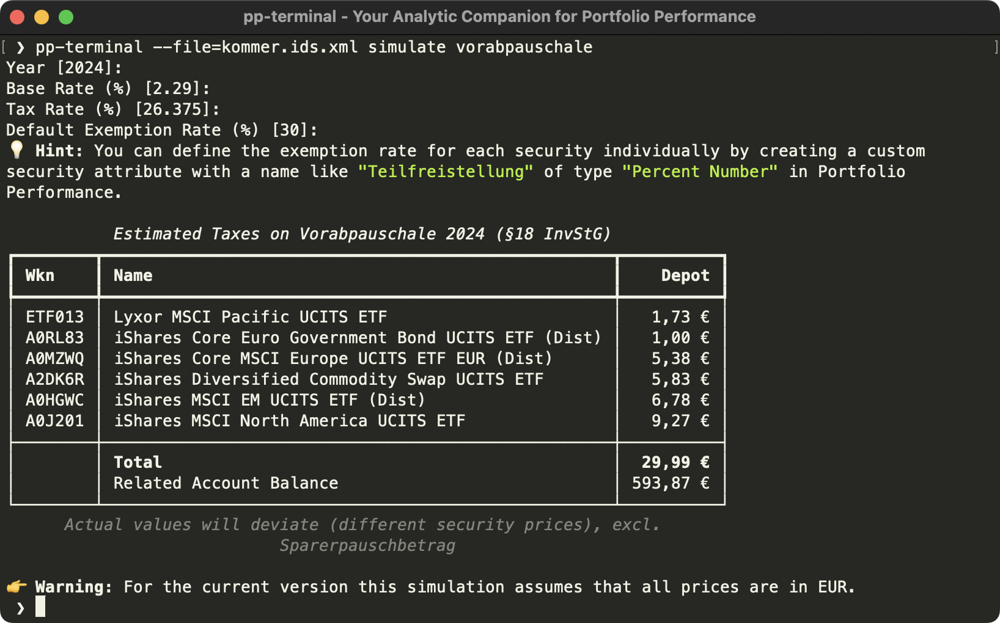

# pp-terminal - The Analytic Companion for Portfolio Performance

 [](https://dev-investor.de/chat)

A powerful command-line interface (CLI) that allows programmatic access to [Portfolio Performance](https://www.portfolio-performance.info/) data 
to offer a whole new level of insights into your assets.  

The tool can also act as an [MCP server](#mcp-server) to give AI models like Claude Opus, Gemini or Qwen (anonymized) access to your portfolio to 
intelligently answer questions like
- "Am I overweight in any security?"
- "What do you think about my portfolio allocation?"
- "Are there any issues with my portfolio?"
- "Do I have enough cash to cover the upcoming Vorabpauschale taxes?"
- "I need X EUR after tax. Which securities should I sell to minimize taxes?"

For example, _pp-terminal_ includes a CLI command to calculate the preliminary tax values ("Vorabpauschale") for Germany:



> [!IMPORTANT]
> I am not a tax consultant. All results of this application are just a non-binding indication and without guarantee.
> They may deviate from the actual values.

> [!TIP]
> Using MoneyMoney for managing your finances? Check out how to [export Sankey Charts](https://github.com/ma4nn/moneymoney-sankey).

_pp-terminal_ is a lightweight tool for all the nice-to-have features that won't make it into the official Portfolio Performance app.
This can be because of country-dependant tax rules, complex Java implementation, highly individual requirements, 
too many edge-cases, etc.

1. [Available Commands](#available-commands)
2. [Requirements](#requirements)
3. [Installing](#installing)
4. [Usage](#usage-)
5. [Contributing](#contributing)
6. [Known Limitations](#known-limitations-)
7. [License](#license)

## Available Commands

Code completion for commands and options is available.  
You can choose between different output formats like JSON, CSV or Excel with the `--output` option.

In addition to the standard set, you can easily [create your own commands](#user-content-create-your-own-command-️) 
and share them with the community.

By default, `pp-terminal --help` provides the following commands:

### MCP Server

The application can be used to access Portfolio Performance data using an [MCP server](https://modelcontextprotocol.io/docs/getting-started/intro).  
This has several advantages over directly working on the XML file, e.g.
- Safely access sensitive financial data by e.g. anonymization and only exposing relevant portfolio information
- Significantly reduce context length and token usage

The MCP server can be started with the following command:
```
pp-terminal mcp
```

### Inspect Portfolio

| Command           | Description                                                                            |
|-------------------|----------------------------------------------------------------------------------------|
| `view accounts`   | Get detailed information about the balances per each deposit and/or securities account |
| `view securities` | Get detailed information about the securities                                          |

The commands can be customized in the [configuration file](#configuration-file):
```toml
[commands.view.accounts]
fields = ["AccountId", "Name", "Balance"]  # call with --fields=xx to see a list of all available fields

[commands.view.securities]
fields = ["SecurityId", "Name", "Shares"]
```

### Simulate Scenarios

| Command               | Description                                                                                        |
|-----------------------|----------------------------------------------------------------------------------------------------|
| `simulate interest`   | Calculate how much interest you should have been earned per account and compare with actual values |
| `simulate share-sell` | Calculate gains and taxes if a security would be sold in future (based on FIFO capital gains)      |
| `simulate vap`        | Run a simulation for the expected German preliminary tax ("Vorabpauschale") on the portfolio       |

The tax configuration for the simulations can be customized in the [configuration file](#configuration-file):
```toml
[tax]
rate = 26.375  # percentage
# Optionally define the already paid taxes per share (e.g. for the share-sell command)
files = ["taxes_paid.csv"]  # Format: isin;year;deemed_income_per_share
exempt-rate = 30  # percentage
exempt-rate-attribute = "b3c38686-2d22-4b5d-8e38-e61dcf6fdde3"  # for per-security exemption rates 
```

### Validate Data

| Command               | Description                                                 |
|-----------------------|-------------------------------------------------------------|
| `validate`            | Run all validation checks on the portfolio data             |
| `validate accounts`   | Run configured accounts validations, e.g. balance limits    |
| `validate securities` | Run configured security validations, e.g. prices up-to-date |

This is a sample of validation rules that can be configured in the [configuration file](#configuration-file):
```toml
# Note: the rules are processed in this order, each rule type only triggers once for each entity

# Validate a certain bank account does not have more than a certain custody fee threshold
[[commands.validate.accounts.rules]]
type = "balance-limit"
value = 25000
applies-to = ["c9c57e01-7ea0-4e70-bed9-4656941f7687"]  # Portfolio Performance account id from the XML file

# Validate that each bank account is within the deposit insurance limit
[[commands.validate.accounts.rules]]
type = "balance-limit"
value = 100000

# Use date attributes in Portfolio Performance to validate against (e.g. when special interest rate offers end)
[[commands.validate.accounts.rules]]
type = "date-passed-from-attribute"
value = "fgdeb0dd-8bd7-47b1-ac3f-30fedd6a47e9"  # Portfolio Performance date attribute id from the XML file

# Verify security prices are up-to-date
[[commands.validate.securities.rules]]
type = "price-staleness"
severy = "error"  # default, can be omitted
value = 90
[[commands.validate.securities.rules]]
type = "price-staleness"
severity = "warning"
value = 30

# Validate current cost basis (FIFO) against limit, e.g. for exit taxation thresholds ("Wegzugsbesteuerung")
[[commands.validate.securities.rules]]
type = "cost-basis-limit"
value = 500000.0
severity = "warning"

# Validate tax csv file
[[commands.validate.securities.rules]]
type = "paid-tax-validation"
severity = "warning"
tolerance = 0.01
```

#### Temporal Validation

All validation rules optionally support temporal constraints through the `valid-months` configuration option. This allows rules to run only during specific months of the year:

```toml
# VAP liquidity check runs only in December and January (when VAP is calculated)
[[commands.validate.accounts.rules]]
type = "vap-liquidity"
valid-months = [12, 1]  # 1=January, 12=December

# Price staleness check runs only in March (e.g. for annual review)
[[commands.validate.securities.rules]]
type = "price-staleness"
value = 90
valid-months = [3]
```

### Export

| Command  | Description                                                                 |
|----------|-----------------------------------------------------------------------------|
| `export` | Save the Portfolio Performance XML file to a different location             |

Use the `--anonymize` flag to export an anonymized version:
```bash
pp-terminal --file depot.xml --anonymize export anonymized.xml
```

Anonymization can be customized in the [configuration file](#configuration-file):
```toml
[anonymize.attributes."a1b2c3d4-e5f6-7890-abcd-ef1234567890"]
provider = "iban"  # for all available providers see https://faker.readthedocs.io/en/master/providers.html
[anonymize.attributes."fgdeb0dd-8bd7-47b1-ac3f-30fedd6a47e9"]
provider = "pyfloat"
args = { min_value = 0.0, max_value = 1.0, right_digits = 2 }
```

## Requirements

- [pipx](https://pipx.pypa.io/latest/#install-pipx) to install the application (without having to worry about different Python runtimes)
- Portfolio Performance version >= 0.70.3
- Portfolio Performance file must be saved as "XML with id attributes"

## Installing

```
pipx install pp-terminal
```

Once installed, update to the latest with:

```
pipx upgrade pp-terminal
```

## Usage 💡

### Portfolio Performance XML File
> [!TIP]
> The application **does not modify** the original Portfolio Performance file and works completely offline.

All commands require the Portfolio Performance XML file as input.    
You can either provide that file as first option to the command
```
pp-terminal --file=depot.xml view accounts
```
or use a configuration file (see below).

To view all available arguments you can always use the `--help` option.

### Configuration File
To persist the CLI options you can pass a configuration file in [TOML format](https://toml.io/en/) with `pp-terminal --config=config.toml --help`.  

The configuration file can also be provided as environment variable: `PP_TERMINAL_CONFIG=config.toml pp-terminal --help`

The CLI options always overwrite the settings in the configuration file.

```toml
file = "portfolio_performance.xml"
precision = 4
```

### Customize Number Formats
If you want another formatting for numbers, assure that the terminal has the correct language settings, e.g. for Germany 
set environment variable `LANG=de_DE.UTF-8`.

### Disable Colored Output
To disable all colors in the console output for a better readability, you can set the `NO_COLOR=1` [environment variable](https://no-color.org/).

## Contributing

### Propose Changes

To contribute improvements to _pp-terminal_ just follow these steps:

1. Fork and clone this repository
2. Run `make`
3. Verify build with `poetry run pp-terminal --version`
4. Create a new branch based on `master`: `git checkout master && git pull && git checkout -b your-patch`
5. Implement your changes in this new branch
6. Run `make` to verify everything is fine
7. Submit a [Pull Request](https://docs.github.com/de/pull-requests/collaborating-with-pull-requests/proposing-changes-to-your-work-with-pull-requests/about-pull-requests)

### Create Your Own Command ⚒️

Developers can easily extend the default _pp-terminal_ functionality by implementing their own commands. Therefore, the Python
[entry point](https://packaging.python.org/en/latest/specifications/entry-points/) `pp_terminal.commands` is provided.
To hook into a sub-command, e.g. `view`, you have to prefix the entry point name with `view.`.

The most basic _pp-terminal_ command looks like this:

```python
from pp_terminal.output import Console
import typer

app = typer.Typer()
console = Console()


@app.command
def hello_world() -> None:
    console.print("Hello World")
```
This will result in the command `pp-terminal hello-world` being available.

For more sophisticated samples take a look at the packaged commands in the `pp_terminal/commands` directory,
e.g. a good starting point is [view_accounts.py](https://github.com/ma4nn/pp-terminal/blob/master/pp_terminal/commands/view_accounts.py).

The commands must be grouped by action, e.g. `view accounts` or `simulate share-sell`.

The app uses [Typer](https://typer.tiangolo.com/) for composing the commands and [Rich](https://github.com/Textualize/rich)
for nice console outputs. The Portfolio Performance XML file is read with [ppxml2db](https://github.com/pfalcon/ppxml2db) 
and efficiently held in [pandas dataframes](https://pandas.pydata.org/).

If your command makes sense for a broader audience, I'm happy to accept a [pull request](#propose-changes).

## Issues 🚧

> [!IMPORTANT]
> The script is still in beta version, so there might be Portfolio Performance files that are not compatible with and also public APIs can change.

In case you are experiencing any problems:
1. Create an anonymized version of your portfolio with `pp-terminal --file depot.xml --anonymize export anonymized.xml` (verify!)
2. Add the `--verbose` option to the command that is causing the issue
3. And [submit a new issue](https://github.com/ma4nn/pp-terminal/issues/new) and include the results from steps 1. and 2.

## License

This project is licensed under the GNU General Public License v3.0 (GPL-3.0). See the [LICENSE](./LICENSE) file for more details.
