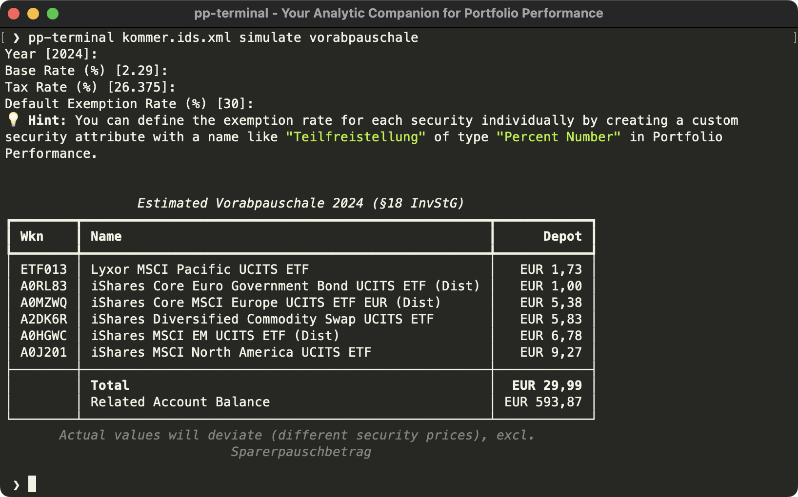

# pp-terminal - Analytic Companion for Portfolio Performance


A CLI application for the great [Portfolio Performance app](https://www.portfolio-performance.info/) to run different 
analysis on the portfolio data.

For example, _pp-terminal_ can calculate the preliminary tax ("Vorabpauschale") for Germany:



_pp-terminal_ is a handy tool for all the nice-to-have features that won't make it into the official Portfolio Performance app.
This can be because of country-dependant tax rules, complex Java implementation, highly individual requirements, 
too many edge-cases, etc.  
The application internally uses [ppxml2db](https://github.com/pfalcon/ppxml2db) to parse the Portfolio Performance XML 
file and **does not modify** the original xml file.

By default, `pp-terminal` provides the following commands:

| Command                   | Description                                                                         |
|---------------------------|-------------------------------------------------------------------------------------|
| `view accounts`           | display a detailed table with the balances per account                              |
| `view depots`             | display a detailed table with the current values per depot                          |
| `simulate vorabpauschale` | run a simulation for the German preliminary tax ("Vorabpauschale") on the portfolio |

Code completion for commands and options is also available.

In addition to the standard set, developers can easily [create their own commands](#user-content-create-your-own-command-️) and share them with the community.

**Important Note:**  
I am not a tax consultant. All results of this application are non-binding and without guarantee.
They may deviate from the actual values.

## Requirements

- [pipx](https://pipx.pypa.io/latest/#install-pipx) to install the application (without having to worry about different Python runtimes)
- Portfolio Performance version >= 0.70.3
- XML file must be saved as "XML with ids"

## Installing

```
pipx install git+https://github.com/ma4nn/pp-terminal
```

## Usage 💡

The commands mentioned above all require the Portfolio Performance XML file as input.  
You can either provide that file as first parameter to the command
```
pp-terminal depot.xml view depots
```
or by setting an environment variable you can omit the parameter
```
export PP_TERMINAL_INPUT_FILE=depot.xml
pp-terminal view depots
```

To view all available arguments you can always use the `--help` option.

If you want another formatting for numbers, assure that the terminal has the correct language settings, e.g. for Germany:
```
export LANG=de_DE.UTF-8
```

## Create Your Own Command ⚒️

Developers can easily extend the default _pp-terminal_ functionality by implementing their own commands. Therefore, the Python
[entry point](https://packaging.python.org/en/latest/specifications/entry-points/) `pp_terminal.commands` is provided.
To hook into a sub-command, e.g. `view`, you have to prefix the entry point name with `view.`.

The most basic _pp-terminal_ command looks like this:

```python
from rich.console import Console
import typer

app = typer.Typer()
console = Console()


@app.command
def hello_world() -> None:
    console.print("Hello World")
```
This will result in the command `pp-terminal hello-world` being available.

For more sophisticated samples take a look at the packaged commands in the `pp_terminal/commands` directory, 
e.g. a good starting point is `view_accounts.py`.

The app uses [Typer](https://typer.tiangolo.com/) for composing the commands and [Rich](https://github.com/Textualize/rich)
for nice console outputs. The data is held in [panda dataframes](https://pandas.pydata.org/).

If your command makes sense for a broader audience, I'm happy to accept a pull request.

## Known Limitations 🚧

- The script is still in beta version, so there might be Portfolio Performance XML files that are not compatible with and also public APIs can change
- Only Euro currency is supported at the moment

## License

This project is licensed under the GNU General Public License v3.0 (GPL-3.0). See the [LICENSE](./LICENSE) file for more details.
